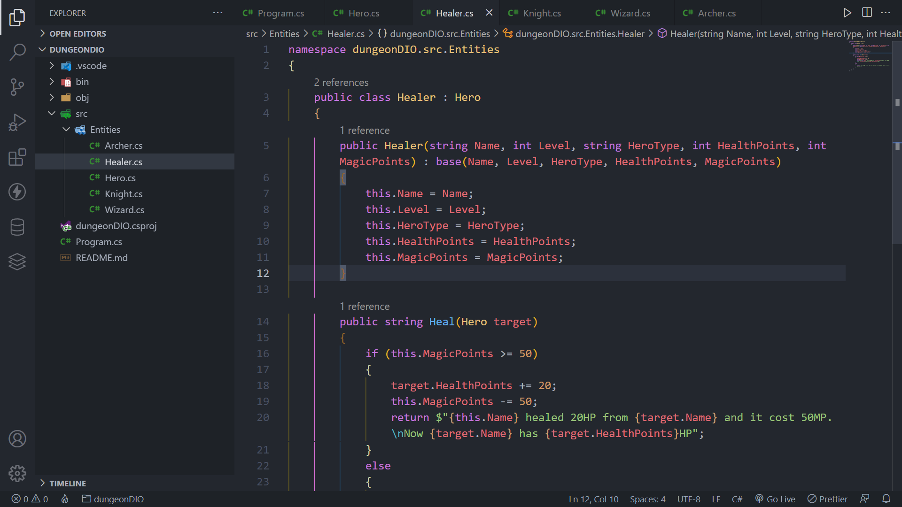

# RPG Game Application to implement the concepts of Object Oriented Programming using C#

## Overview

### Screenshot

## My proccess

### Built with

-   C#
-   .NET 6.0

### What i learned

In this project i could apply the acquired knowledge about Object Oriented Programming to develop a RPG Game application, creating classes to each type of character and implementing different attack models to each class.

Project developed in the Impulse Bootcamp of Digital Innovation One as a console application.

## Author

-   GitHub - Vinícius dos Santos Verissimo (https://github.com/viniciusdsv93)
