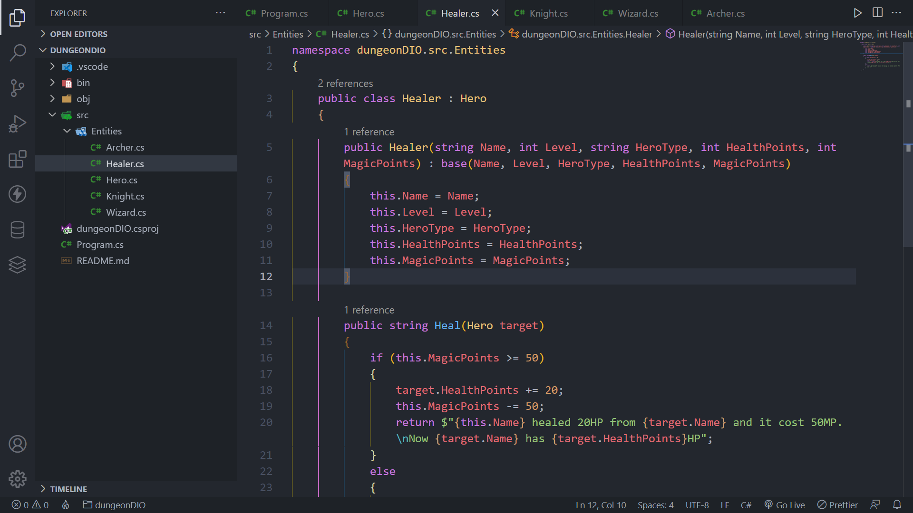

# Aplicação de Jogo de RPG para aplicação de conceitos do Paradigma de Programação Orientada a Objetos usando C#

## Visão Geral

### Screenshot

## Meu processo

### Construído com

-   C#
-   .NET 6.0

### O que aprendi

Neste projeto eu pude aplicar os conhecimentos obtidos sobre o Paradigma da Programação Orientada a Objetos para desenvolver uma aplicação de jogo de RPG com criação de classes para cada tipo de personagem, com a implementação de modelos de ataque diferentes dependendo da classe que os invocou.
Projeto desenvolvido junto ao Bootcamp Impulse da Digital Innovation One na forma de aplicação de console.

## Autor

-   GitHub - Vinícius dos Santos Verissimo (https://github.com/viniciusdsv93)
